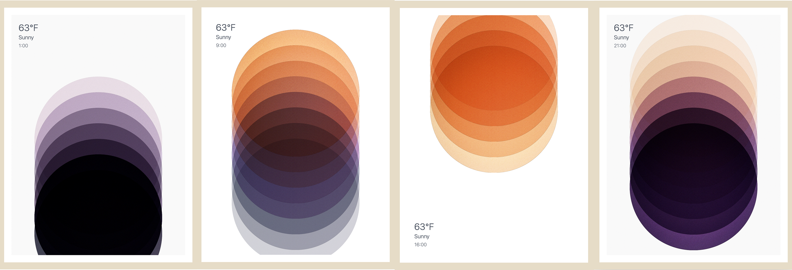

# tijdvorm

script to publish live art to samsung the frame tvs, using local weather data and some nice graphics



## credits

the artwork of this project has been skillfully vibe coded by https://x.com/joonasvirtanen

## disclaimer

i hate python so i blind vibe coded this project using cursor/gemini. no guarantees this wont fuck up your tv.

## how to run

1. install deps (for >2022 frame models use this pip git by @NickWaterton, otherwise use the regular "samsungtvws")

```bash
pip install "git+https://github.com/NickWaterton/samsung-tv-ws-api.git#egg=samsungtvws[async,encrypted]" playwright asyncio PIL requests logging &&
playwright install chromium --with-deps
```

2. configure the script to use your tv's ip and optionally the weatherapi location
   note that your TV must be on the same exact network as this host, VLANs are not allowed by samsung
   also note the `DELETE_OLD_ART` parameter, which will make sure the TV doesnt get overloaded with art images which are never deleted (by default 1 image every minute)
3. run `python main.py`

## eastereggs uploader (optional)

You can manage `eastereggs/` from your phone (upload + enable/disable) with a tiny local web UI.

### start everything (one command)

```bash
./start.sh
```

If you only want the uploader UI (no TV loop):

```bash
START_TV=0 ./start.sh
```

### backend (FastAPI)

```bash
pip install -r requirements-web.txt
uvicorn server:app --host 0.0.0.0 --port 8000
```

### frontend (Svelte)

```bash
cd frontend
npm install
npm run dev
```

Open it on your phone (same Wi‑Fi): `http://<your-computer-ip>:5173`

### debugging & troubleshooting

The project includes comprehensive debugging tools for AirPlay and DLNA streaming:

#### DLNA Debugging (Recommended for Samsung TVs)
```bash
cd debug/dlna
python quick_test.py                    # Fast DLNA functionality test
python test_dlna_performance.py         # Comprehensive performance testing
python test_dlna_discovery.py           # Device discovery and compatibility
python test_dlna_performance.py reliability 10  # 10-minute reliability test
```

#### AirPlay Debugging
```bash
cd debug/airplay
python debug_pyatv.py          # Interactive AirPlay diagnostic menu
python debug_pyatv.py scan     # Scan for AirPlay devices
python debug_pyatv.py test     # Run comprehensive tests
python debug_pyatv.py diagnose # iPhone compatibility analysis

# Node.js alternative testing
npm install
node test_airplayer.js
```

#### Key Findings
- **DLNA works reliably** with Samsung Frame TVs ✅
- **AirPlay works with iPhone** but not with client libraries ❌
- **Both pyatv & airplayer fail** with same Samsung compatibility issues
- **Issue confirmed to be Samsung TV protocol implementation**, not client libraries

See `debug/airplay/README.md` for detailed troubleshooting.

### explicit filtering (Home Assistant)

Each uploaded image can be marked **Explicit** in the web UI.
When it’s “easter egg time”, `main.py` will **filter out explicit images** unless your Home Assistant boolean is ON.

Create a `.env` in the repo root (you can copy `env.example`) and set:
- `HA_BASE_URL` (e.g. `https://ha.netlob.casa`)
- `HA_TOKEN` (long-lived access token)
- `HA_EXPLICIT_ENTITY` (default: `input_boolean.explicit_frame_art`)
